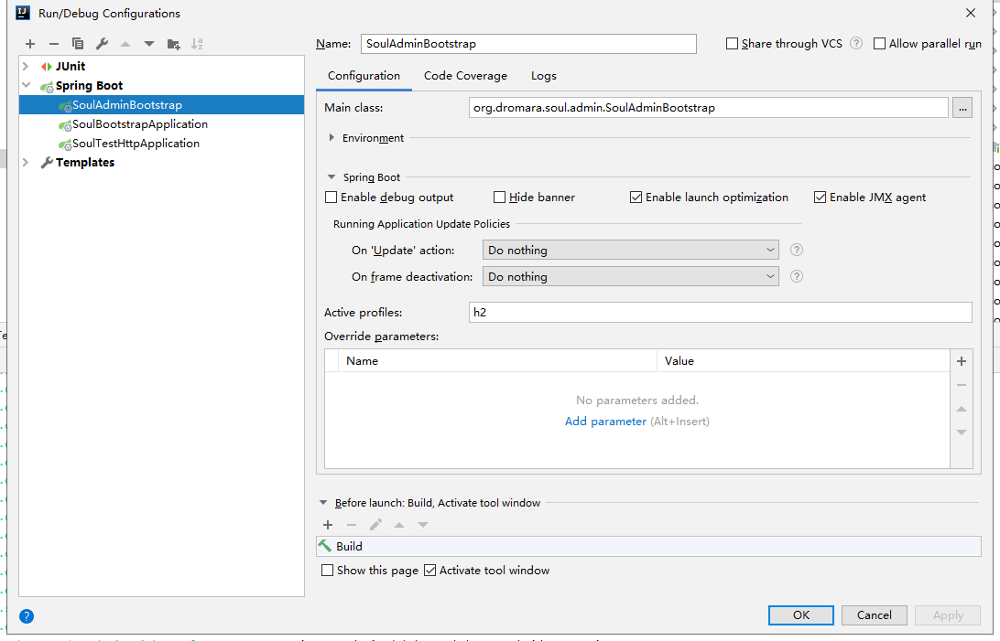
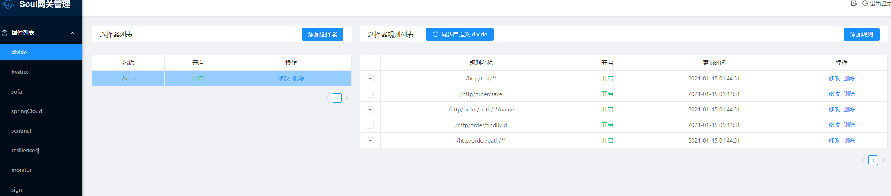
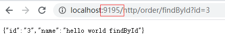

## 初识soul网关

### soul简介
soul是一个异步的, 高性能的, 跨语言的, 响应式的API网关, 作者在参考了Kong, Spring-Cloud-Gateway等优秀的网关后, 站在巨人的肩膀上, Soul由此诞生!  

#### soul核心Features
* 提供了诸如限流、熔断、转发和路由监控等插件；
* 与 HTTP、RESTful、WebSocket、Dubbo 和 Spring Cloud 无缝对接；
* 支持热插拔, 用户可以定制化开发；
* 为了灵活的适配, 选择器和规则可以动态的适配；
* 支持集群部署；
* 支持 A/B 测试和灰度发布。

#### 架构图


#### 执行流程


这样一个好的网关, 我们需要怎么学习它呢？当然是深♂入研究源代码啦, 在接下来的28天里, 我们将会尝试尽可能的了解到soul的细节, 也会学习到SPI, 设计模式的实际使用, 响应式编程, 对其他框架的整合的技巧等一系列知识点, 从而提升整体技术水平.  

### 调试soul环境准备
* jdk8
* idea/eclipse（笔者使用idea）
* mysql （可选 soul现可支持h2数据库）
* maven3 （或idea自带）

既然是学习soul我们先到soul的仓库来一个GitHub版的一键三连（watch star和fork）, 地址是https://github.com/dromara/soul  
通过fork到自己仓库的地址clone到本机, 网速慢的可安装加速插件或借道Gitee, 在此不再赘述.  
为了保证启动的时候没有编译之类的问题, 也方便定位问题先把整个项目install一遍, 如果没有单独安装maven是用的idea的maven需要在本机环境变量的path里面加上maven路径: idea安装目录的JetBrains\IntelliJ IDEA 2019.2.2\plugins\maven\lib\maven3\bin
```batch
mvn clean package install 
-Dmaven.test.skip=true 
-Dmaven.javadoc.skip=true 
-Drat.skip=true -Dcheckstyle.skip=true
```
如果遇到模块缺失, 单独install该模块再重新install就可以了.  
一切准备就绪之后我们就可以尝试启动它了, 先启动soul-admin的SoulAdminBootstrap, 这是一个标准的springboot项目, 架构类似业务代码的MVC模式, 用来管理网关的行为和对网关的监控. 如果没有准备mysql数据库则需要开启h2的配置文件, 启动方法如下  

再启动SoulBootstrapApplication, 一般也没什么问题.  
最后准备我们的真正的后台服务, 我们自己写一个springboot项目, 然后参考soul官方文档接入soul. 当然我们也可以启动soul自带的example, 我们以soul-example-http为例子. 主要注意的是, 后台服务在配置文件需要配置的是soul-admin的地址（本例子中admin是localhost:9095）, 而我们访问网关的时候则是需要通过网关的地址（soul-bootstrap则是localhost:9195）  
我们先看看我们的admin是什么情况, 直接打开localhost:9095, 初始账号密码是admin,123456. 然后在插件列表的divide我们能看到后台服务注册到网关的情况.  

然后我们可以尝试通过网关发起一次调用  

可以看到正确返回了, 但我们对中间发生了什么一无所知, 同时在log看到了一句error, 究竟是怎么回事呢？我们明天继续
```text
2021-01-15 01:50:26.350  INFO 9136 --- [-work-threads-1] o.d.soul.plugin.base.AbstractSoulPlugin  : divide selector success match , selector name :/http
2021-01-15 01:50:26.350  INFO 9136 --- [-work-threads-1] o.d.soul.plugin.base.AbstractSoulPlugin  : divide selector success match , selector name :/http/order/findById
2021-01-15 01:50:26.358  INFO 9136 --- [-work-threads-1] o.d.s.plugin.httpclient.WebClientPlugin  : The request urlPath is http://192.168.3.125:8188/order/findById?id=3, retryTimes is 0
2021-01-15 01:50:26.462  WARN 9136 --- [-work-threads-1] io.netty.bootstrap.Bootstrap             : Unknown channel option 'SO_TIMEOUT' for channel '[id: 0xfc6ba462]'
2021-01-15 01:50:26.772 ERROR 9136 --- [-work-threads-3] o.d.soul.plugin.base.utils.CheckUtils    : can not match selector data: divide
```

---
### 总结
今天我们初步认识了soul, 知道他是一个高性能的网关, 也提到了如何上手一个开源项目, 并逐步的把项目编译并启动起来. 接下来我们将开始阅读源码部分. 