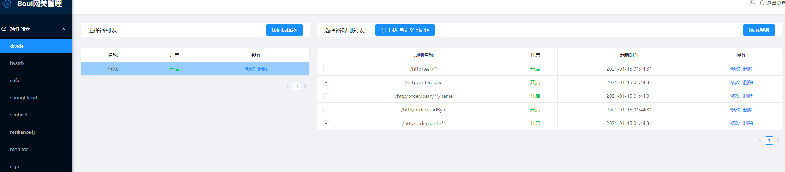
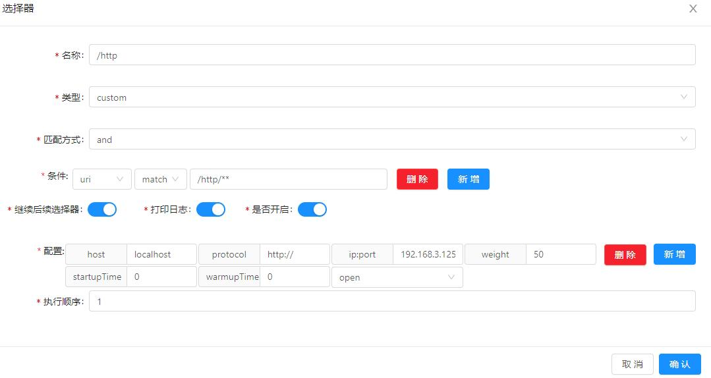
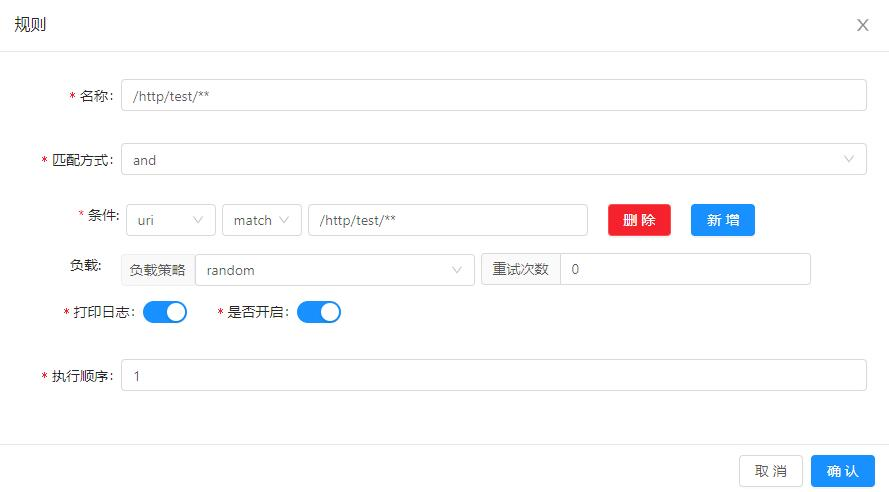
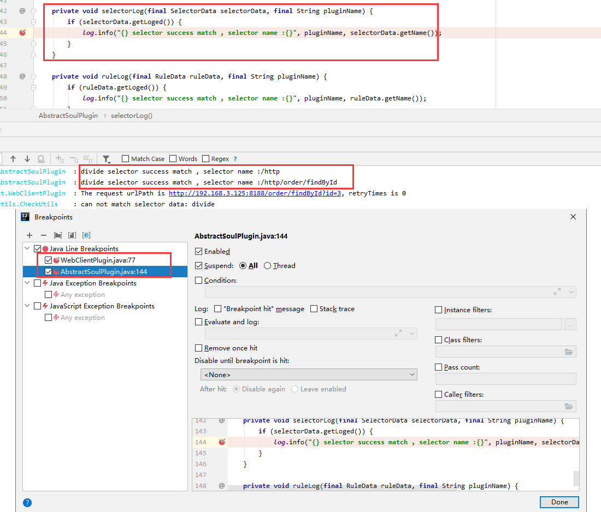
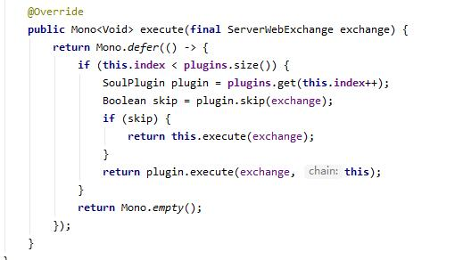
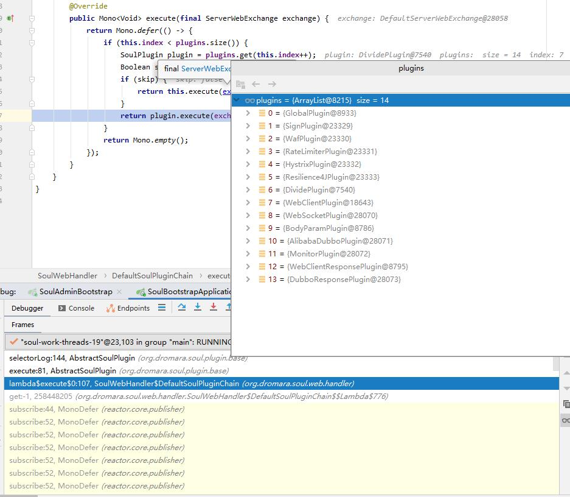
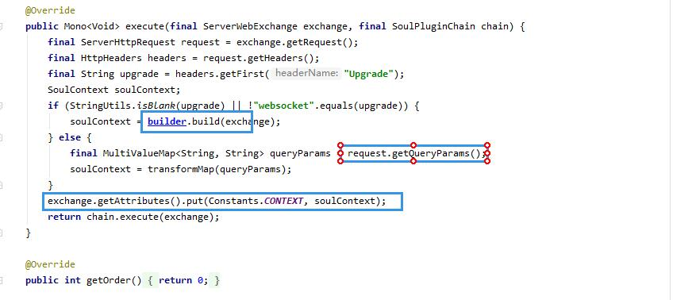
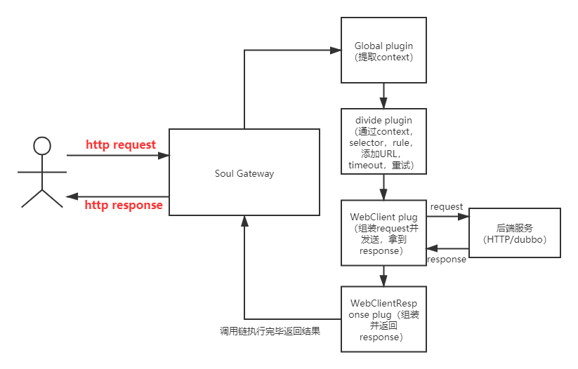

## 一次HTTP请求的soul之旅

在上一次的soul-admin中我们在divide插件看到了后端服务的信息，其中有选择器和规则，这些在代码里面是怎么体现的呢？

抱着这些疑问我们通过一次请求打印的log设置了断点

通过断点和调用栈信息我们成功找到入口是一个execute方法，里面有14个插件，他会挨个调用，如果遇到需要跳过的则跳过执行。

通过debug我找到了实际被执行的插件，分别是: Global，divide，WebClient和WebClientResponse。

* Global  
  

在global插件我们可以看到他根据request的header的信息会封装一个soulContext到exchange的attributes中，但这个context是干嘛的呢？我们接着往下看。 

* divide  

由于divide是几个基础插件之一，所以都复用了abstract的execute方法，即通过缓存数据提取selector（选择器）和rule（规则）的信息  

在拿到selector和规则之后，divide会通过soulContext，selector，rule，来找到后端服务集群，通过相应的路由规则拿到URL，timeout时间，重试次数等信息。

* WebClient  

在WebClient我们可以看到他主要做了两件事，第一件事是通过exchange的attribute拿到URL，timeout时间和重试次数来组装基础的requestBody。  
第二件事是继续通过exchange的request来进一步组装requestBody最后发送请求到真实的后端，最后把response添加到attribute中。  

* webClientResponse  

因为我对Mono的用法不是很熟，但是根据插件的顺序来看有几种response的处理方法，而response肯定是要最后返回出去的，所以我在此大胆推测，chain.execute(exchange).then的作用是将chain的插件全部走完，他最终会返回个空的Mono，之后response会执行then的方法。    
在这里面我们可以看到他把attribute的response拿了出来，根据不同的statusCode封装成soul自定义的错误码或按照正常的2xx返回，并且处理好cookies和headers，最后将response返回到我们的客户端。
---
### 调用链回顾

### 疑问和解答
可以看到在整个调用过程中response依赖于request调用后端拿到的response，request的参数依赖于divide根据context拿到的参数，在soul是怎么保证顺序的呢? 通过阅读源码发现，在定义插件列表的时候就已经通过插件的GetOrder方法进行了排序。同时，这里的责任链模式是通过权重排序后挨个执行的，所以统一在SoulWebHandler往下执行，需要用一个index记录插件执行到的位置，而不能用迭代器/foreach的方法来遍历插件。  

##总结
通过对一次HTTP请求的debug，深刻理解了整个责任链是怎么设计的，每个插件的分工，如何支持插件的可插拔，排序。稍有不足的是因为没写过响应式编程不太了解Mono怎么用的，对一些实际细节处理也没深究（用处也不大）。明天将会将会较为深度的对soul-admin的功能进行演示
