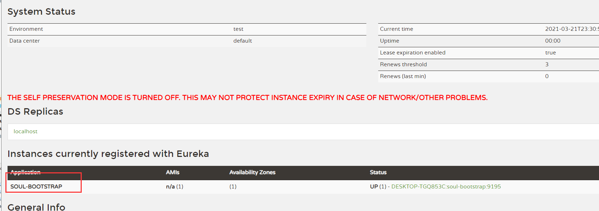
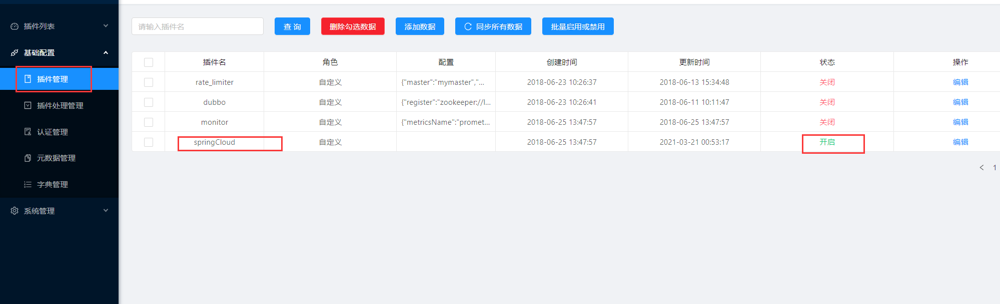
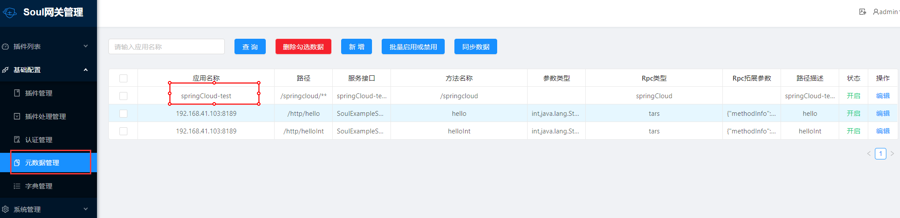
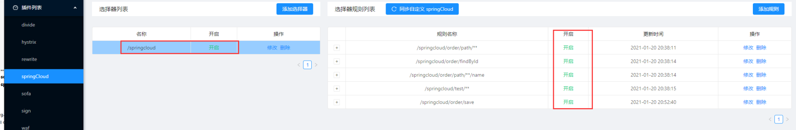
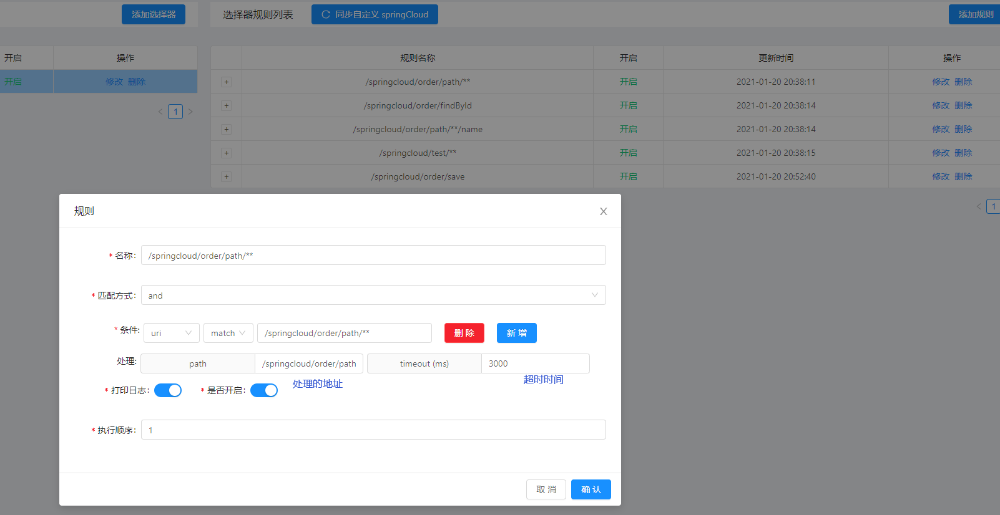
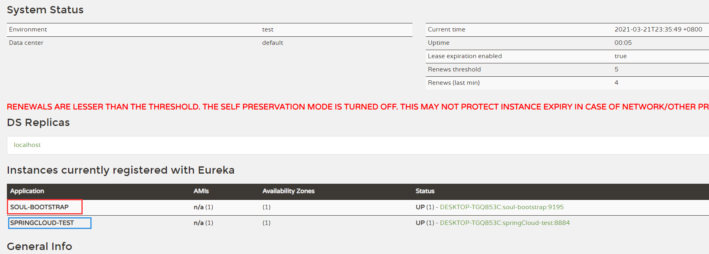
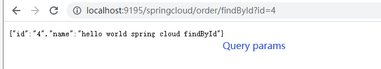
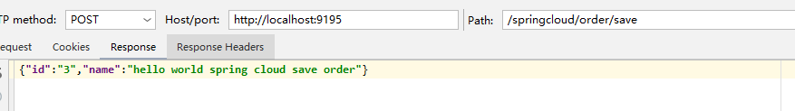
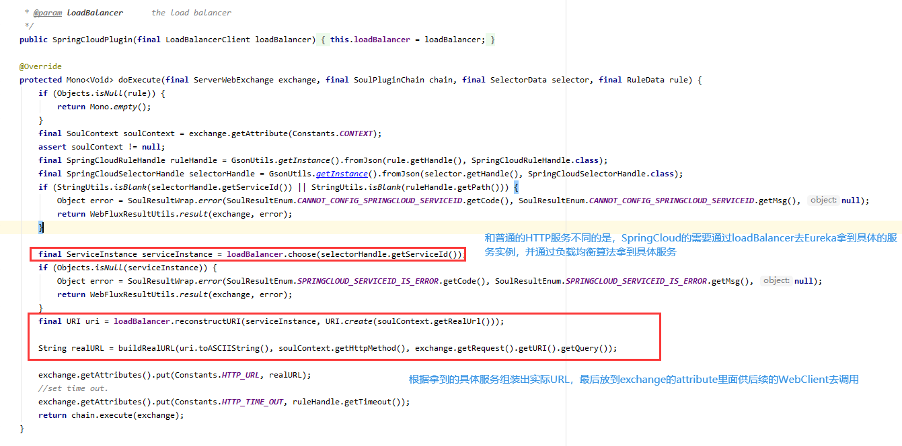

网关除了转发一般的HTTP请求这种基本的功能，还有一个很大的作用就是不同的协议进行转化，从而达到一处调用，连接所有的效果。


### SpringCloud体系介绍

SpringCloud不是单单一个框架，而是微服务治理的一整套解决方案， 通过不同组件的组合来达成不同的服务治理的效果。

常见的SpringCloud体系会用到的组件有下列几个

服务发现——Netflix Eureka

客服端负载均衡——Netflix Ribbon

断路器——Netflix Hystrix

服务网关——Netflix Zuul

分布式配置——Spring Cloud Config

以上的组件也不一定是固定的，例如Eureka可以替换成Nacos或者Consul，其他组件也可以用类似功能的所替代。而服务的本身，一般是HTTP服务，具体实现一般是一个Springboot项目，soul在这里则充当了类似Zuul的角色作为服务的前置网关。


### Soul接入SpringCloud服务

在启动我们的bootstrap之前，我们要先启动Eureka，可以是额外启动Eureka服务，也可以启动soul的`soul-examples-eureka`，这样我们就有了一个Eureka注册中心。


在Soul项目里面，如果需要开启对SpringCloud的支持，需要引入相关的依赖，在soul-bootstrap的pom里面，SpringCloud相关的依赖只是被注释了起来，我们只需要把它解开

```
<dependency>
     <groupId>org.dromara</groupId>
     <artifactId>soul-spring-boot-starter-plugin-springcloud</artifactId>
     <version>${project.version}</version>
 </dependency>
 <dependency>
     <groupId>org.springframework.cloud</groupId>
     <artifactId>spring-cloud-commons</artifactId>
     <version>2.2.0.RELEASE</version>
 </dependency>
 <dependency>
     <groupId>org.springframework.cloud</groupId>
     <artifactId>spring-cloud-starter-netflix-ribbon</artifactId>
     <version>2.2.0.RELEASE</version>
 </dependency>
 <dependency>
    <groupId>org.springframework.cloud</groupId>
    <artifactId>spring-cloud-starter-netflix-eureka-client</artifactId>
    <version>2.2.0.RELEASE</version>
</dependency>
```

在依赖中我们能看到用来适配SpringCloud的 `soul-spring-boot-starter-plugin-springcloud`和`spring-cloud-commons ` ，负载均衡模块`Ribbon`和服务发现`Eureka`。然后在`soul-bootstrap`下的`application-local.yml`把eureka配置注释去掉，然后启动`soul-bootstrap`， 这样网关就启动了，也注册到Eureka上面。

```
eureka:
  client:
    serviceUrl:
      defaultZone: http://localhost:8761/eureka/
  instance:
    prefer-ip-address: true
```

访问`http://localhost:8761`我们就可以看见bootstrap被注册上来了。



在启动完admin和bootstrap之后，在admin面板还要打开SpringCloud的插件。



在这些都准备就绪之后就能启动`soul-examples-springcloud`下的`SoulTestSpringCloudApplication`了。在看见注册的log之后，我们的SpringCloud服务就被注册上来了

```
2021-01-20 23:43:54.058  INFO 19712 --- [pool-1-thread-1] o.d.s.client.common.utils.RegisterUtils  : springCloud client register success: {"appName":"springCloud-test","context":"/springcloud","path":"/springcloud/order/save","pathDesc":"","rpcType":"springCloud","ruleName":"/springcloud/order/save","enabled":true} 
2021-01-20 23:43:54.067  INFO 19712 --- [pool-1-thread-1] o.d.s.client.common.utils.RegisterUtils  : springCloud client register success: {"appName":"springCloud-test","context":"/springcloud","path":"/springcloud/order/path/**/name","pathDesc":"","rpcType":"springCloud","ruleName":"/springcloud/order/path/**/name","enabled":true} 
2021-01-20 23:43:54.081  INFO 19712 --- [pool-1-thread-1] o.d.s.client.common.utils.RegisterUtils  : springCloud client register success: {"appName":"springCloud-test","context":"/springcloud","path":"/springcloud/order/findById","pathDesc":"","rpcType":"springCloud","ruleName":"/springcloud/order/findById","enabled":true} 
2021-01-20 23:43:54.098  INFO 19712 --- [pool-1-thread-1] o.d.s.client.common.utils.RegisterUtils  : springCloud client register success: {"appName":"springCloud-test","context":"/springcloud","path":"/springcloud/order/path/**","pathDesc":"","rpcType":"springCloud","ruleName":"/springcloud/order/path/**","enabled":true} 
2021-01-20 23:43:54.115  INFO 19712 --- [pool-1-thread-1] o.d.s.client.common.utils.RegisterUtils  : springCloud client register success: {"appName":"springCloud-test","context":"/springcloud","path":"/springcloud/test/**","pathDesc":"","rpcType":"springCloud","ruleName":"/springcloud/test/**","enabled":true} 
```

然后在admin确认插件信息、元数据管理，选择器等数据被正确注册到soul上面





和别的几个协议稍微有所不同，SpringCloud插件的规则下面有代理路径和超时时间的配置



在Eureka管理界面也能看到我们的SpringCloud服务被注册到Eureka了




在上面的工作准备完成了之后就可以在浏览器尝试通过get调用SpringCloud的服务了


post带Json调用


### SpringCloud插件源码分析



可以看到SpringCloud插件相对还是比较简单的，因为服务本体实质上还是个HTTP服务，所以可以和HTTP服务共用WebClientPlugin去调用实际的服务。在这里SpringCloud的实现实际上是取代了divide的功能，从自己的upstream cache里面取得实际服务实例换成了通过load balancer（在这里是ribbon）获得服务实例。

